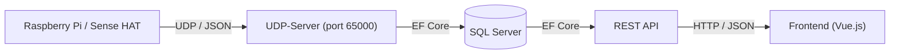

# 🌡️ Temp-Flow


Temp-Flow er et IoT-baseret overvågningssystem til indeklima. Raspberry Pi-enheder med Sense HAT-sensorer indsamler temperatur, luftfugtighed og lufttryk og sender dataene via UDP til en central backend. Backenden gemmer målingerne i en SQL Server-database og stiller dem til rådighed via en REST API. Et webbaseret frontend giver brugeren et overblik over rum og sensorer med realtidsdata og historiske grafer.

---

## Indholdsfortegnelse

- [🌡️ Temp-Flow](#️-temp-flow)
  - [Indholdsfortegnelse](#indholdsfortegnelse)
  - [Funktioner](#funktioner)
  - [Teknologier](#teknologier)
  - [Arkitektur](#arkitektur)
  - [Kom i gang](#kom-i-gang)
    - [Forudsætninger](#forudsætninger)
    - [Installation af backend](#installation-af-backend)
    - [Databaseopsætning](#databaseopsætning)
    - [Start af services](#start-af-services)
    - [Opsætning af Raspberry Pi-klient](#opsætning-af-raspberry-pi-klient)
    - [Kørsel af frontend](#kørsel-af-frontend)
  - [API-oversigt](#api-oversigt)
  - [Projektstruktur](#projektstruktur)
  - [Test](#test)

---

## Funktioner

- Indsamling af sensordata (temperatur, luftfugtighed, lufttryk) via Raspberry Pi Sense HAT
- Realtidstransmission af sensordata over UDP
- Automatisk oprettelse af sensorer i databasen ved første registrering
- REST API med fuld CRUD for rum og sensorer
- Tildeling af sensorer til rum
- Historisk visning af sensordata grupperet pr. time
- Sletning af sensordata ældre end et angivet antal dage
- Webbaseret dashboard med temperaturgrafer (Chart.js)
- Swagger/OpenAPI-dokumentation tilgængelig i alle miljøer
- Emulator til lokal udvikling uden fysisk Sense HAT-hardware

---

## Teknologier

| Komponent         | Teknologi                                   |
| ----------------- | ------------------------------------------- |
| Backend API       | ASP.NET Core 8, C#                          |
| Datalag           | Entity Framework Core 9, Repository-pattern |
| Database          | Microsoft SQL Server (MSSQL)                |
| UDP-server        | .NET 8 konsol-applikation                   |
| Sensor-klient     | Python 3, Raspberry Pi Sense HAT            |
| Frontend          | Vue.js 3, Bootstrap 5, Axios, Chart.js      |
| API-dokumentation | Swagger / OpenAPI (Swashbuckle)             |
| Test              | xUnit, Selenium WebDriver                   |

---

## Arkitektur



1. **Raspberry Pi-klienten** (`UDP_client.py`) aflæser sensoren hvert minut og sender dataene som JSON over UDP.
2. **UDP-Serveren** modtager pakken, opretter sensoren i databasen hvis den ikke kendes, og gemmer målingen.
3. **REST API'en** udstiller endpoints til rum- og sensoradministration samt datahentning.
4. **Frontend** kalder API'en og viser temperaturdata, afvigelse fra måltemperatur og historiske grafer.

---

## Kom i gang

### Forudsætninger

- [.NET 8 SDK](https://dotnet.microsoft.com/download/dotnet/8.0)
- Microsoft SQL Server (lokal instans eller ekstern server)
- Python 3.x (til Raspberry Pi-klienten)
- En webbrowser med en lokal HTTP-server (f.eks. Live Server i VS Code) til frontend

### Installation af backend

1. Klon repositoriet:
   ```bash
   git clone <repository-url>
   cd Temp-Flow/Backend
   ```

2. Åbn løsningen `Backend.sln` i Visual Studio eller byg via CLI:
   ```bash
   dotnet build
   ```

### Databaseopsætning

Forbindelsesstrengen konfigureres i [Backend/DataAccess/EnvironmentSecrets.cs](Backend/DataAccess/EnvironmentSecrets.cs). Opdater `_dbConnectionString` med din egen SQL Server-forbindelsesstreng:

```csharp
private string _dbConnectionString = "Server=<server>;Database=<database>;User Id=<user>;Password=<password>;MultipleActiveResultSets=true;";
```

Kør EF Core-migrations for at oprette databaseskemaet:

```bash
cd Backend/DataAccess
dotnet ef database update
```

### Start af services

Start UDP-Serveren (lytter pa port 65000):
```bash
cd Backend/UDP-Server
dotnet run
```

Start REST API'en:
```bash
cd Backend/REST_API
dotnet run
```

Swagger UI er tilgængelig på `http://localhost:<port>/swagger`.

### Opsætning af Raspberry Pi-klient

1. Installer afhængigheder (pa Raspberry Pi eller i virtuelt miljø):
   ```bash
   cd Raspberry_Pi
   pip install sense-hat
   ```

2. Konfigurer `UDP_client.py` — sæt `BROADCAST_IP` til serverens IP-adresse og `DEVELOPMENT_MODE = False` ved kørsel pa rigtig hardware:
   ```python
   DEVELOPMENT_MODE = False
   BROADCAST_IP = "<server-ip>"
   PORT = 65000
   ```

3. Kør klienten:
   ```bash
   python UDP_client.py
   ```

   Under udvikling bruges `DEVELOPMENT_MODE = True`, som aktiverer den medfølgende SenseHat-emulator.

### Kørsel af frontend

Åbn `Frontend/`-mappen med en lokal HTTP-server, f.eks. via Live Server i VS Code. API-base-URL'en konfigureres øverst i de enkelte JavaScript-filer:

```javascript
const baseUrl = 'http://localhost:<port>/api/';
```

---

## API-oversigt

<details>
<summary>Vis alle endpoints</summary>

<table>
  <thead>
    <tr><th>Metode</th><th>Endpoint</th><th>Beskrivelse</th></tr>
  </thead>
  <tbody>
    <tr><td>GET</td><td><code>/api/Rooms</code></td><td>Hent alle rum med sensorer og data</td></tr>
    <tr><td>POST</td><td><code>/api/Rooms</code></td><td>Opret nyt rum</td></tr>
    <tr><td>GET</td><td><code>/api/Rooms/{id}</code></td><td>Hent enkelt rum</td></tr>
    <tr><td>PUT</td><td><code>/api/Rooms/{id}</code></td><td>Opdater rum</td></tr>
    <tr><td>DELETE</td><td><code>/api/Rooms/{id}</code></td><td>Slet rum</td></tr>
    <tr><td>POST</td><td><code>/api/Rooms/{id}/addsensor/{sensorId}</code></td><td>Tildel sensor til rum</td></tr>
    <tr><td>GET</td><td><code>/api/Rooms/{id}/data/recent</code></td><td>Nyeste sensordata for rum grupperet pr. time</td></tr>
    <tr><td>GET</td><td><code>/api/Sensors</code></td><td>Hent alle sensorer</td></tr>
    <tr><td>GET</td><td><code>/api/Sensors/{id}</code></td><td>Hent enkelt sensor</td></tr>
    <tr><td>GET</td><td><code>/api/Sensors/{id}/data</code></td><td>Hent alle data for sensor</td></tr>
    <tr><td>GET</td><td><code>/api/Sensors/{id}/grouped-by-hour</code></td><td>Sensordata grupperet pr. time</td></tr>
    <tr><td>PUT</td><td><code>/api/Sensors/{id}</code></td><td>Opdater sensor</td></tr>
    <tr><td>DELETE</td><td><code>/api/Sensors/{id}</code></td><td>Slet sensor</td></tr>
    <tr><td>GET</td><td><code>/api/SensorData</code></td><td>Hent alle sensordata</td></tr>
    <tr><td>GET</td><td><code>/api/SensorData/{id}</code></td><td>Hent enkelt sensordata-post</td></tr>
    <tr><td>GET</td><td><code>/api/SensorData/recent/{days}</code></td><td>Hent data fra de seneste N dage</td></tr>
    <tr><td>DELETE</td><td><code>/api/SensorData/older-than/{days}</code></td><td>Slet data ældre end N dage</td></tr>
  </tbody>
</table>

</details>

---

## Projektstruktur

```
Temp-Flow/
├── Backend/                        # .NET 8-løsning
│   ├── REST_API/                   # ASP.NET Core Web API
│   │   ├── Controllers/            # RoomsController, SensorsController, SensorDataController
│   │   └── Program.cs              # Konfiguration og DI-registrering
│   ├── UDP-Server/                 # Konsol-applikation til modtagelse af UDP-pakker
│   │   └── Program.cs              # Lytter pa port 65000 og gemmer data i databasen
│   ├── DataAccess/                 # Datalag
│   │   ├── Models/                 # Room, Sensor, SensorData
│   │   ├── DTOs/                   # Dataoverførselsobjekter
│   │   ├── Interfaces/             # IRoomRepository, ISensorRepository
│   │   ├── Repositories/          # Implementationer af repositories
│   │   └── AppDbContext.cs         # EF Core DbContext
│   ├── REST_APITests/              # Unit tests for API-controllers
│   └── DataAccessTests/            # Repository-tests og Selenium UI-tests
├── Frontend/                       # Webapplikation
│   ├── index.html                  # Dashboard
│   ├── rooms.html                  # Rumoversigt og administration
│   ├── sensors.html                # Sensorliste
│   ├── css/                        # Stylesheets
│   └── js/                         # Vue.js applikationslogik
└── Raspberry_Pi/                   # Python sensor-klient
    ├── UDP_client.py               # Sender sensordata via UDP
    └── sense_HAT_emulator.py       # SenseHat-emulator til lokal udvikling
```

---

## Test

Projektet indeholder to testprojekter:

**REST_APITests** — Unit tests for API-controllers med mockede repositories:
```bash
cd Backend
dotnet test REST_APITests/
```

**DataAccessTests** — Tests af repository-laget samt Selenium-baserede UI-tests:
```bash
cd Backend
dotnet test DataAccessTests/
```
